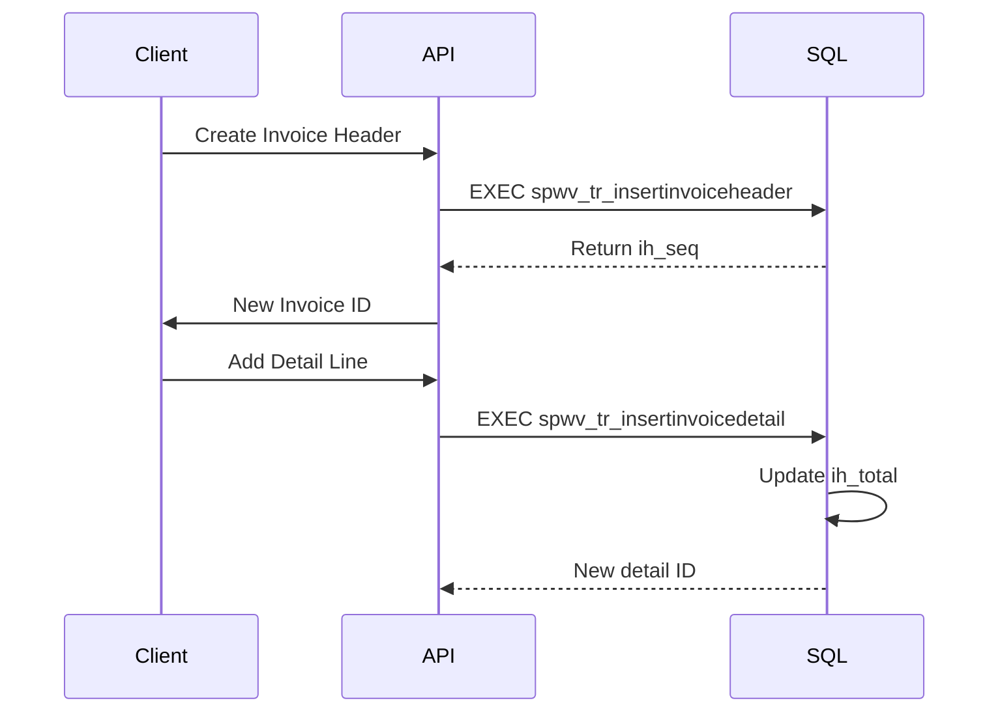

# 🚀 InvoiceFlow: Smart Invoice Management System

Effortlessly manage invoices with a robust SQL backend, a powerful .NET API, and a sleek AngularJS frontend. Automate invoice generation, track details, and ensure data integrity with transactional operations.

## 🌟 Features
- **Database Layer**
  - Invoice Header, Detail, and Sequence tables
  - Stored procedures for CRUD operations with automatic total calculation
  - Transaction-safe insert/update/delete operations

- **API Layer** (.NET Web API)
  - Full invoice header/detail models
  - Repository pattern with transactional support
  - RESTful endpoints for all operations

- **Client Layer** (AngularJS + DevExpress)
  - Interactive invoice listing grid
  - Modal-driven create/update flows
  - Detail management with inline editing
  - Responsive UI with DevExpress components

## 🛠 Tech Stack
**Frontend**  
  


**Backend**  


**Database**  


## 🚀 Installation

### Prerequisites
- SQL Server 2019+
- .NET 7 SDK
- Node.js 18+
- Angular CLI

```bash
# Clone repository
git clone git@github.com:HopeforgeDev/InvoiceFlow.git
cd InvoiceFlow

# Restore NuGet packages
dotnet restore

# Install client dependencies
cd ClientApp
npm install
```

Start API:
```bash
dotnet run --project InvoiceFlow.API
```

## 💻 Client Setup
```bash
cd ClientApp

# Configure API endpoint
echo 'export const environment = {
  production: false,
  apiUrl: "https://localhost:5001/api"
};' > src/environments/environment.ts

# Start Dev Server
ng serve
```

## 🔄 Transaction Flow


## 📜 License
MIT License - see [LICENSE](LICENSE) for details

---

**Happy Invoicing!** 💰📄
